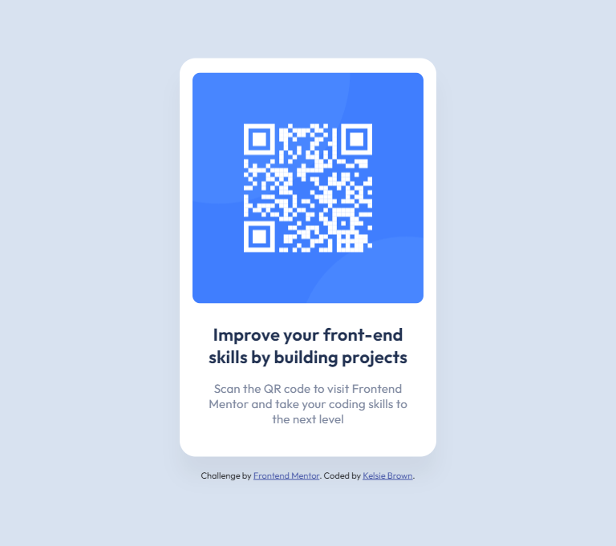

# Frontend Mentor - QR code component solution

This is a solution to the [QR code component challenge on Frontend Mentor](https://www.frontendmentor.io/challenges/qr-code-component-iux_sIO_H). Frontend Mentor challenges help you improve your coding skills by building realistic projects. 

## Table of contents

- [Overview](#overview)
  - [Screenshot](#screenshot)
  - [Demo](#demo)
- [My process](#my-process)
  - [Built with](#built-with)
  - [Timeframe](#timeframe)
  - [What I learned](#what-i-learned)
  - [Useful resources](#useful-resources)
- [Author](#author)
- [Acknowledgments](#acknowledgments)

## Overview

The challenge of this project was to build out a QR code component and get it looking as close to the design as possible.

## Screenshot



## Demo

- [Live Site](https://kelsiepaige.github.io/qr-code-component/)

## 🚧 My process

### 💻 Built with

- Semantic HTML5 markup
- CSS custom properties
- Flexbox

### ⏳ Timeframe

This project took 30 minutes to complete.

### 💡 What I learned

- How to use Lighthouse to audit this project's performance
- How to center a div element for all screen sizes

```css
  .content-wrapper {
      position: fixed;
      top: 50%;
      left: 50%;
      -webkit-transform: translate(-50%, -50%);
      transform: translate(-50%, -50%);
}
```

### ⚒️ Useful resources

- [Microsoft Live Preview VS Code extention](https://marketplace.visualstudio.com/items?itemName=ms-vscode.live-server) - An extenstion that hosts a local server to preview projects instantly
- [Markup Validation Service](https://validator.w3.org/) - Checks site against W3C standards 
- [Lighthouse](https://developer.chrome.com/docs/lighthouse/overview) - Google Chrome's DevTools auditing tools for website performance, accessibility, and more
- [README Editor](https://readme.so/editor) - Easy way to organize README files

## 🏆 Author

- Frontend Mentor - [@KelsiePaige](https://www.frontendmentor.io/profile/KelsiePaige)  
[](https://kelsiepaige.github.io/portfolio/)
[](https://www.linkedin.com/in/kelsie-paige/)

## Acknowledgements

 - [Frontend Mentor](https://www.frontendmentor.io/) - For awesome coding challenges
